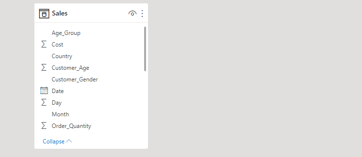

# Bike-Sales-Data-Analyis

# Introduction
This is a bike sales company dataset in Europe. I have been brought in to analyze the sales data from 2011 to 2016. My job is to design a sales dashboard  for the Executives to help them track revenue and profit generated.

# Skills
The following skills were incorporated in this project;
•	Data cleaning using power bi query editor 
•	DAX
•	Quick Measures

# Problem Statement
•	What is the Total Revenue, Total Sales, Total Unit, Gross profit margin and Total no. of customers?

•	Top 5 Countries with highest revenue and profit generated 

•	The Age group distribution of gender by Revenue

•	A sales trend showing the revenue generated each month 

•	Top 5 Product and subcategory by Profit 6. Bottom 5 Product and subcategory by Profit

# Data Modelling
No table model requirement since the dataset only contains one table

# Data Source

The data was from Kaggle

# Visualization
The report consist of only one page housing;

•	Product analysis

•	Sales Trend

# Recommendations
1.Set up a marketing campaign in Canada 
Across all the 4 countries,Canada is the country with the lowest revenue of $7,926,676.00.

2.Stock Up More Of Road Bikes
At $14,083,736, Road Bikes had the highest profit and was 363.24% higher than Touring Bikes, which had the lowest profit at $3,040,263.

3.promotions and ads during July to November
Analyses from the sales trend shows that there is a low level of revenue generated through the month of July to November.

